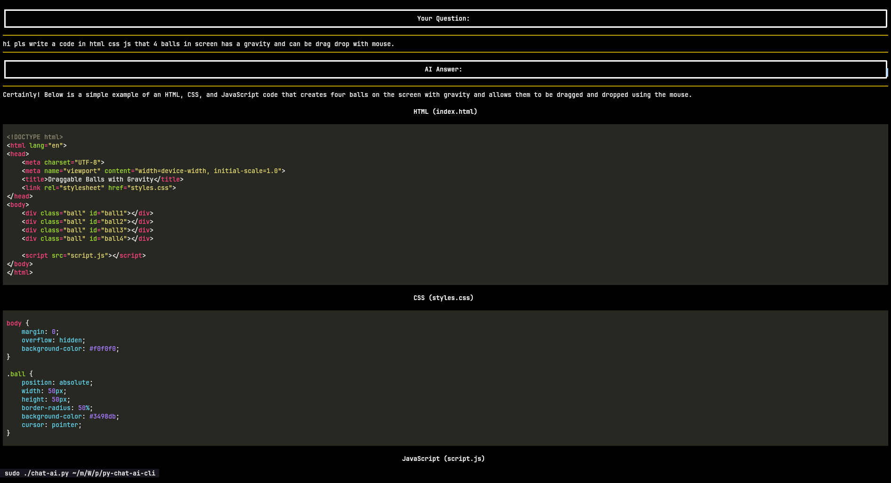
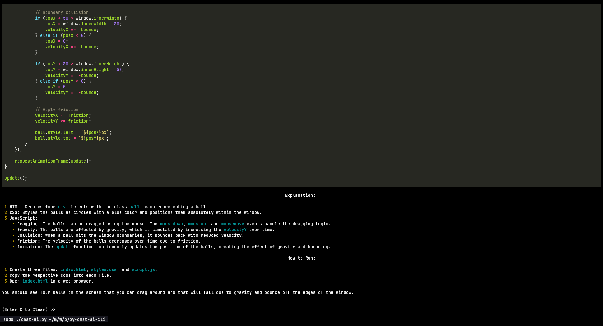

# Chat with AI in Terminal

- Chat with AI models in terminal (openrouter.ai api)





## before Usage(install dependencies)

You need to install these before running the app:

- [rich](https://rich.readthedocs.io/en/latest/introduction.html#installation)
- [dotenv](https://pypi.org/project/python-dotenv/)
- [keyboard](https://pypi.org/project/keyboard/)
- [requests](https://pypi.org/project/requests/)

```bash
pip install rich dotenv keyboard requests
```

## Usage

### Step.0 Go to anywhere you like to clone project

- `git clone https://github.com/TohidEq/py-chat-ai-cli && cd py-chat-ai-cli`

### Step.1 Create `API_KEY`

Go to [openrouter.ai](https://openrouter.ai/) and create a new `API_KEY` and copy it to your clipboard.

### Step.2 Create `.env` file

Create a `.env` file in `py-chat-ai-cli` folder and put your `API_KEY` in it.
like this:

```bash
API_KEY="sk-or-v1-f4b*****************************************************e8d92499"
```

### Step.3 Make app excutable

Run `chmod +x ./chat-ai.py` in terminal.

### Step.4 Run app

Type this to run app:

```bash
sudo ./chat-ai.py
```

Type this to run app **Without Markdown Styles**:

```bash
sudo ./chat-ai.py markdown=off
```

### Got Error?

- try install dependencies with sudo:

```bash
sudo pip install rich dotenv keyboard requests
```
